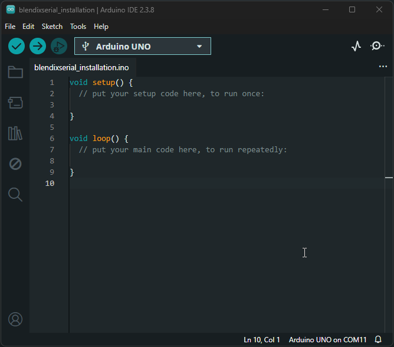

# blendixserial-arduino library  

blendixserial is an Arduino library that enables real-time, two-way communication between Arduino microcontroller boards and Blender 3D software. It allows you to synchronize 3D object properties (position, rotation, and size) between your physical Arduino hardware and virtual 3D scenes in Blender, making it possible to visualize sensor data, control animations with physical devices, and create interactive installations that blend the physical and digital worlds.

## Installation 

The blendixserial library can be installed either through the Arduino Library Manager or manually from source.

### 🔧 Install via Arduino Library Manager

1. Open the **Arduino IDE**
2. Navigate to **Sketch > Include Library > Manage Libraries...**
3. In the search bar, type **BlendixSerial**
4. Find the library in the list and click **Install**

### 📁 Manual Installation (ZIP / GitHub)

If you prefer to install the library manually:

- Download the latest version of the library as a ZIP file  
  👉 [Download blendixserial](https://github.com/electronicstree/blendixserial-arduino/releases/latest)

- Open the **Arduino IDE**

- Go to:  
  **Sketch > Include Library > Add .ZIP Library...**

- Select the downloaded ZIP file

---

### 🔄 Alternative Method

- Extract the ZIP file  
- Move the extracted folder to your Arduino `libraries` directory  

---

### 📂 Example Paths

- **Windows:** `Documents/Arduino/libraries`  
- **macOS / Linux:** `~/Arduino/libraries`

## Resources
For more information and examples, you can visit the [blendixserial-arduino control documentation](https://electronicstree.com/arduino-library-for-blendixserial-addon/).

## License
The BlendixSerial Arduino Labrary is distributed under the GNU General Public License. Please refer to the license text for more details.
